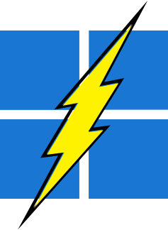

<div align="center">



# Find my windows

**Access your windows at the speed of light**

*like alt+tab but faster*

</div>

## Dependencies

```
vcpkg install imgui[opengl3-binding,glfw-binding]:x64-windows glad:x64-windows glfw3:x64-windows
```

```
cmd.exe /C start D:\Dev\C++\findmytabs\cmake-build-release\findmywindows.exe
```

## Attribution

<a target="_blank" href="https://icons8.com/icon/M9BRw0RJZXKi/windows-11">Windows</a> icon
by <a target="_blank" href="https://icons8.com">Icons8</a>

